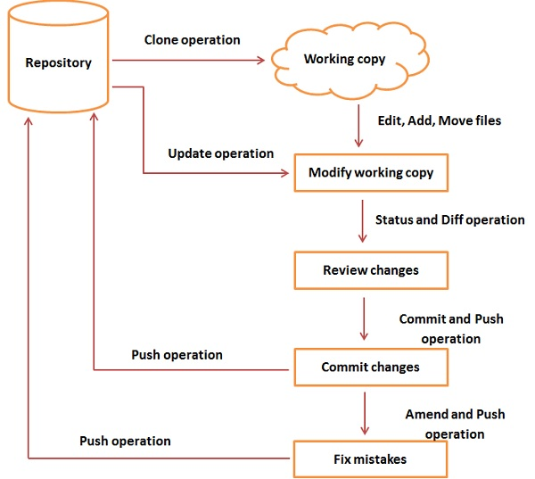

# Version Control System

Types of VCS −
<ul>
<li>Centralized version control system (CVCS).</li>
<li>Distributed/Decentralized version control system (DVCS).</li>
</ul>

# Git Terminology
<ul>
<li><b>Blobs:</b> Binary large objects, each version of a file represent blob. A blob holds the file data but doesn’t contain any metadata about the file.</li>
<li><b>Trees: </b>Tree is an object, it holds blob as well as other directories </li>
<li><b>Commits: </b>Commit holds the current state of the repository. </li>
<li><b>Branches: </b> Branches are used to create another line of development</li>
<li><b>Tags: </b>Tag assign a meaningful name with a specific version in the repository</li>
<li><b>Clone: </b>Clone operation creates the instance of the repository</li>
<li><b>Pull: </b>Pull opertaion copies the changes from a remote repository instance to a local one</li>
<li><b>Push: </b>Push operation copies changes from a local repository instance to a remote one</li>
<li><b>HEAD: </b>HEAD is a pointer, which always points to the latest commit in the branch</li>
<li><b>Revision: </b>Revision represents the version of the source code</li>
<li><b>URL: </b>URL represents the location of the Git repository. (Command: <code>cat .git/config</code>)</li>
</ul>

# Git initial configuration
<code>git config --global user.name "your name"</code> 
<code>git config --global user.email "your email"</code> 
<code>git config --list</code> 

# Git work Flow
Git Work Flow</img>